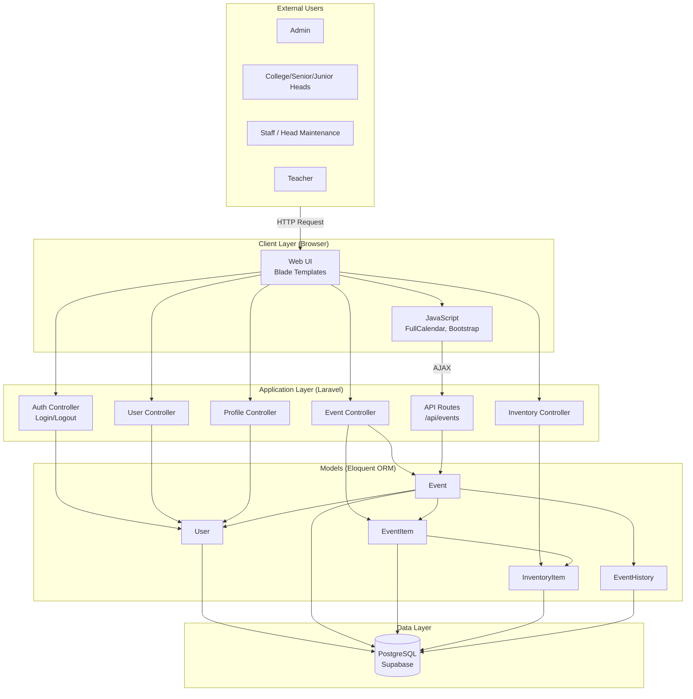
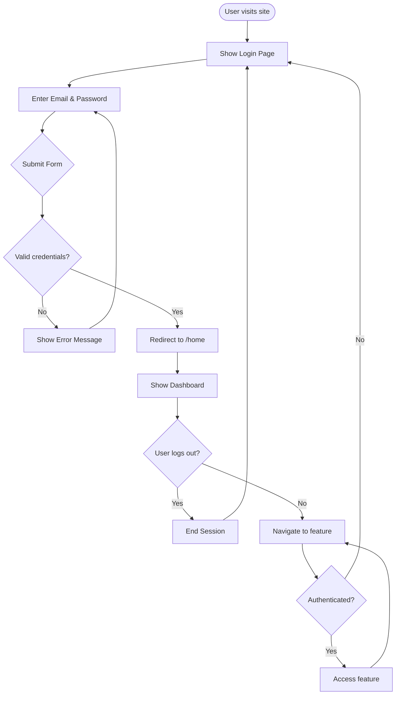
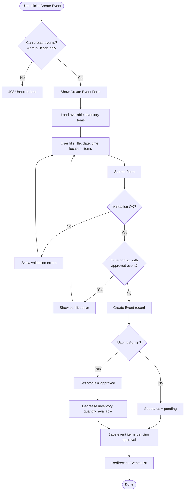
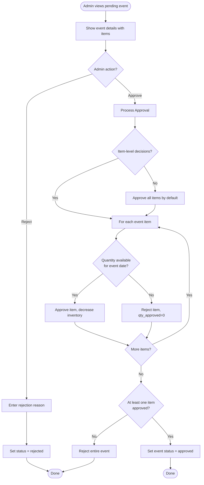
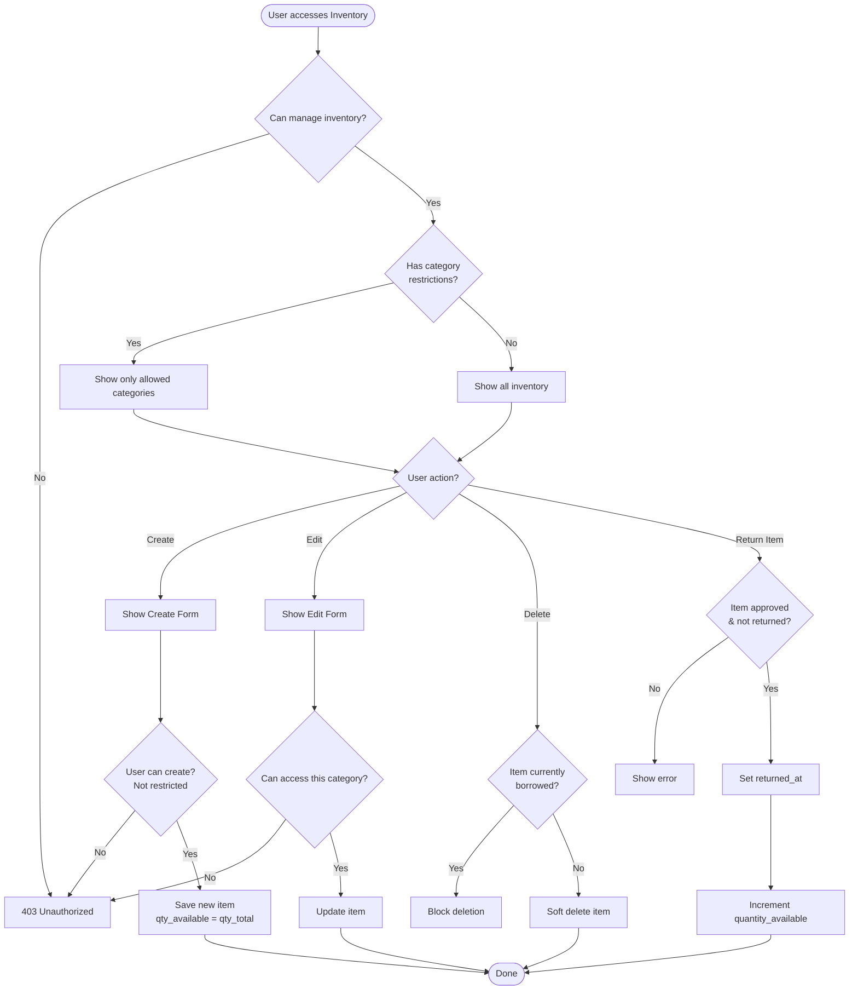
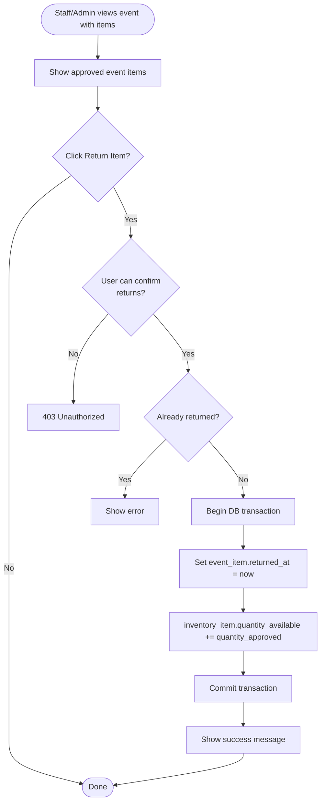
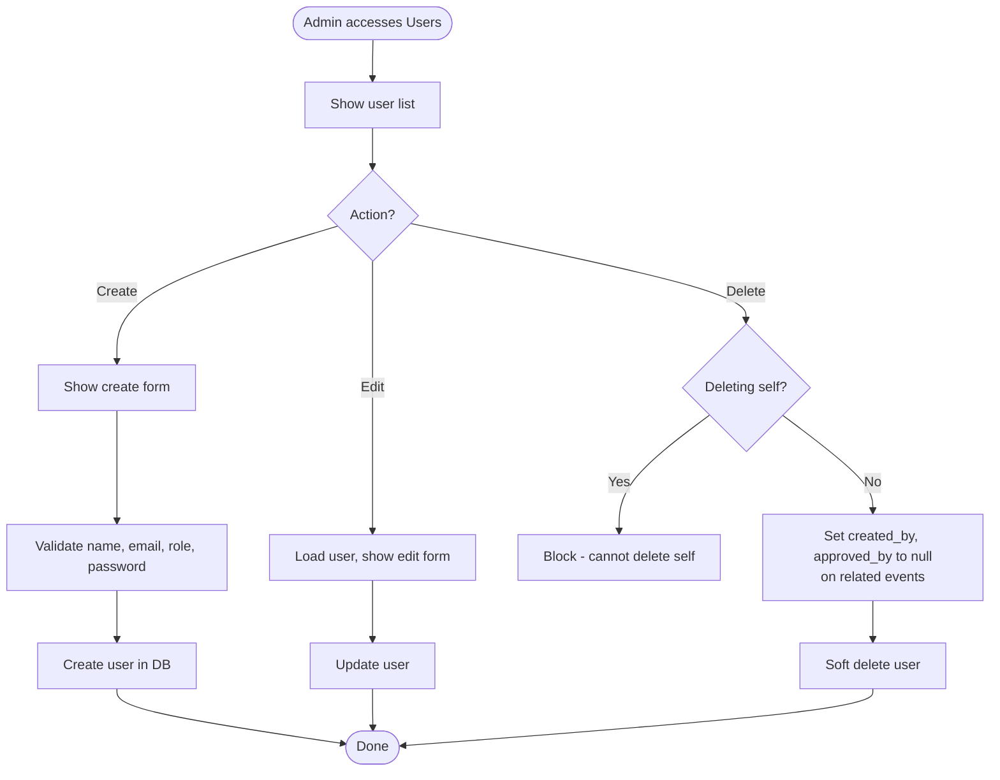
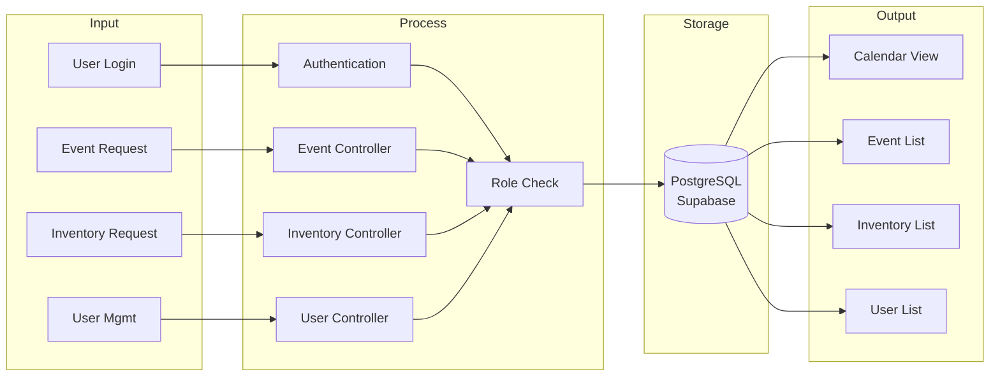

# IETI School Activities Scheduling and Inventory Management System
## Dataflow Diagram & Flowcharts

---

## 1. System Dataflow Diagram

Shows how data moves between users, the web application, Laravel backend, and the database.

### Dataflow Summary

| Source | Flow | Destination |
|--------|------|-------------|
| User (browser) | Login credentials | Auth Controller → User model → PostgreSQL |
| User | Event form (title, date, time, location, items) | Event Controller → Event + EventItems → PostgreSQL |
| Admin | Approve/Reject action | Event Controller → Updates Event status → Decreases Inventory |
| Staff/Admin | Inventory CRUD | Inventory Controller → InventoryItem → PostgreSQL |
| Admin | User management | User Controller → User → PostgreSQL |
| Staff/Admin | Return item | Event Controller → EventItem.returned_at, restores Inventory |
| Calendar | Fetch events | API → Event model → JSON response |

---

## 2. Authentication Flowchart

---

## 3. Event Creation Flowchart

---

## 4. Event Approval Flowchart (Admin)

---

## 5. Inventory Management Flowchart

---

## 6. Item Return Flowchart

---

## 7. User Management Flowchart (Admin Only)

---

## 8. High-Level System Flow

---

## How to View These Diagrams

1. **GitHub**: Push this file to GitHub; Mermaid diagrams render automatically in markdown preview.
2. **VS Code**: Install the "Markdown Preview Mermaid Support" extension, then preview the file.
3. **Online**: Copy Mermaid code blocks into [mermaid.live](https://mermaid.live) to export as PNG/SVG.
4. **Documentation**: Use in your capstone report or presentation by exporting images from Mermaid Live Editor.
